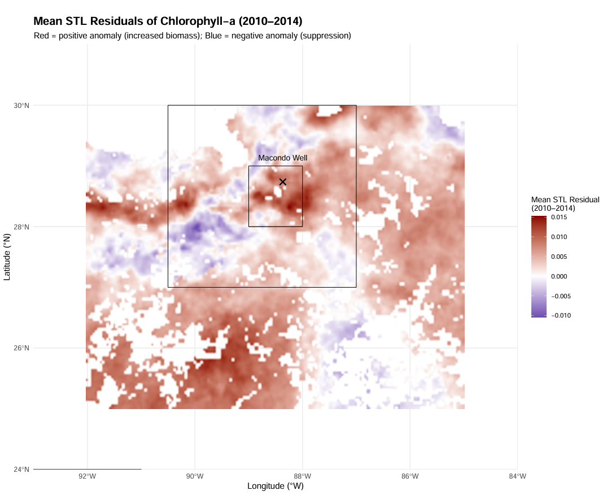
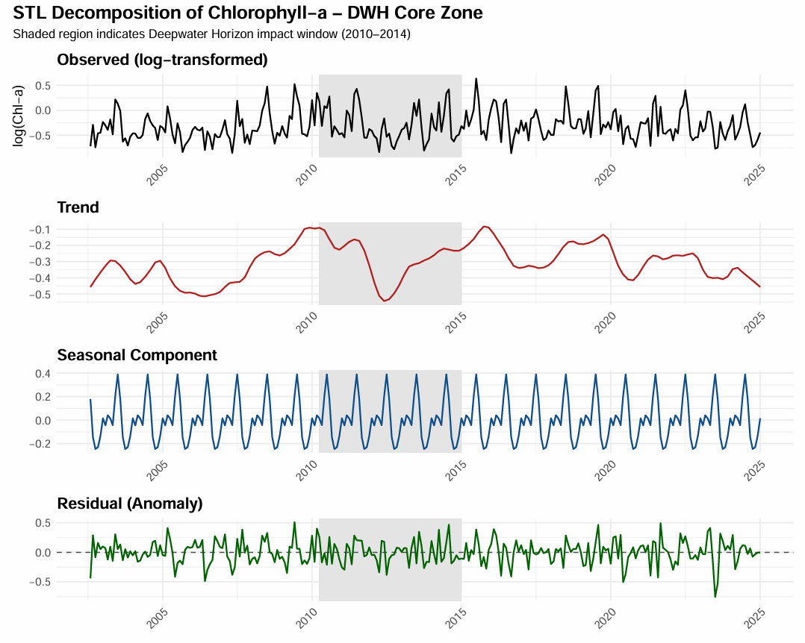
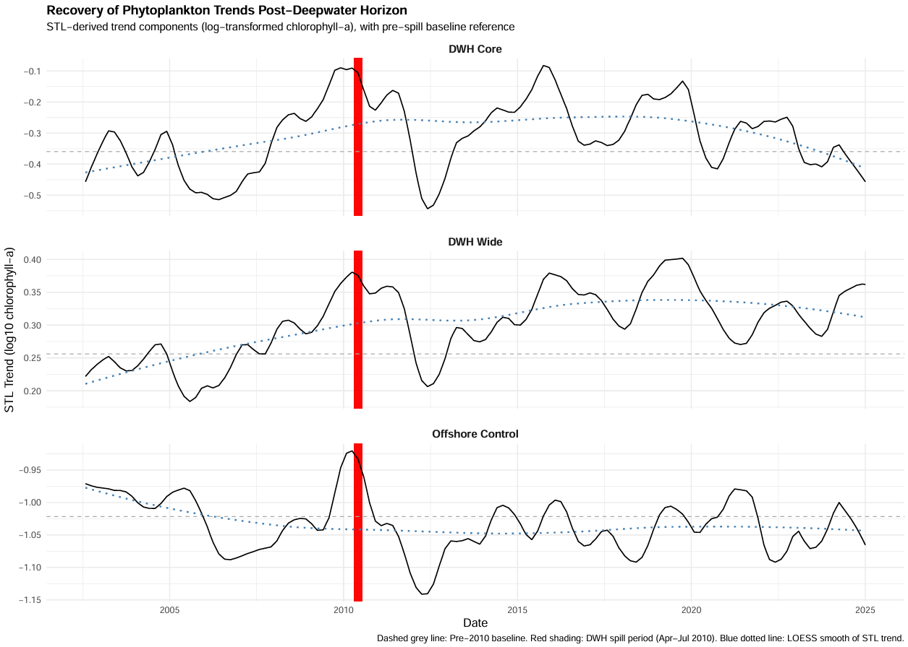
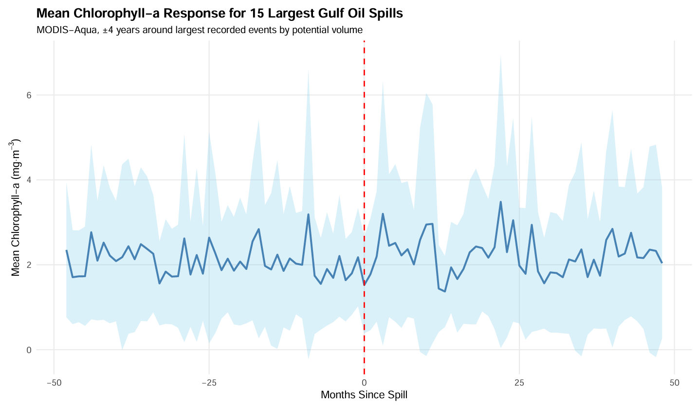

# Long-Term Phytoplankton Disruption in the Gulf of Mexico
### *A Zonal Time-Series Analysis of the Deepwater Horizon Oil Spill*

This MSc research project explores the long-term impact of the 2010 Deepwater Horizon oil spill on phytoplankton productivity in the Gulf of Mexico. Using satellite-derived chlorophyll-a data and time-series decomposition, the study investigates ecological disturbance patterns and evaluates recovery trajectories across defined spatial zones.

> MSc Communicating Data Science (MTHM507) Coursework — Grade: 83%

<p align="center">
  
  <br><br>
  <a href="./FINAL%20REPORT.pdf">
    
  </a>
</p>

---

## Project Objectives
- Quantify the long-term chlorophyll-a suppression following the Deepwater Horizon (DWH) event
- Assess seasonal disruption and recovery in phytoplankton productivity (2002–2024)
- Compare impacts from DWH against 127 other oil spills across the Gulf of Mexico
- Identify spatial heterogeneity and zonal-level ecosystem response

---

## Key Learning Outcomes
- Application of ecological remote sensing and ocean colour time-series
- STL decomposition for seasonality and disturbance detection
- Spatial zonal mapping and impact zone design
- Handling and processing large-scale NetCDF satellite data
- Comparative event analysis and scientific data storytelling

---

## Tools & Technologies
| Category             | Tools & Packages                                                                  |
|----------------------|-----------------------------------------------------------------------------------|
| **Programming**       | R (v4.3+)                                                                         |
| **Spatial Analysis**  | `terra`, `sf`, `stars`, `exactextractr`                                           |
| **Time-Series**       | `forecast`, `zoo`, `tsibble`, `lubridate`                                        |
| **Data Wrangling**    | `dplyr`, `purrr`, `tidyr`, `stringr`                                              |
| **Visualisation**     | `ggplot2`, `ggridges`, `viridis`, `patchwork`, `gt`                               |
| **Reporting**         | Quarto (`.qmd`) for reproducible scientific reporting                            |

---

## Summary of Methods

### 1. Zonal STL Decomposition
Seasonal-trend decomposition (STL) was applied to log-transformed chlorophyll-a time series across three spatial zones: 
- **DWH Core Zone**: highest exposure (>30 days of oil)
- **DWH-Wide Zone**: full 2010 oil slick footprint
- **Offshore Control Zone**: remote, low-impact reference area

### 2. Spatial Residual Anomaly Mapping
Residuals from STL were averaged spatially (2010–2014) to visualise zones of suppressed or elevated phytoplankton activity.

### 3. Event-Aligned Spill Analysis
Chlorophyll time series were aligned to 127 oil spill events (2006–2021) to assess whether ecological responses similar to DWH were common or exceptional.

### 4. Recovery Trajectory Assessment
Trend slopes post-2010 were analysed using STL-derived components to determine the magnitude and direction of phytoplankton recovery.

---

## Selected Results
<details>
<summary>🗂 Key Insights</summary>

- **DWH Core Zone** exhibited strong chlorophyll-a suppression from 2010–2014
- **Post-2015** trends in the core zone remained below baseline, suggesting incomplete recovery
- **Offshore Control Zone** showed stable or increasing productivity throughout
- **No significant impact** was detected for the majority of other oil spills — DWH was ecologically unique
- **Residual maps** visualised localised zones of both suppression and anomalous chlorophyll peaks

</details>

---

## Visual Highlights

### STL Decomposition (DWH Core)


### Residual Anomaly Map (2010–2014)


### Recovery Trajectories by Zone


### Oil Spill Comparison (Top 15 Events)


---

## Repository Structure
```
├── data/                # Processed chlorophyll data & zone shapefiles
├── scripts/             # R scripts for zonal extraction, STL, and plotting
├── figures/             # Final plots and spatial maps
├── FINAL REPORT.pdf     # Full MSc report
```

---

## Citation
> Lewis, J. (2025). *Long-Term Phytoplankton Disruption in the Gulf of Mexico: A Zonal Time-Series Analysis of the Deepwater Horizon Spill*. MSc Communicating Data Science, University of Exeter.

---

<p align="center">
  
</p>

> For questions or collaboration, contact **james066lewis@gmail.com**
